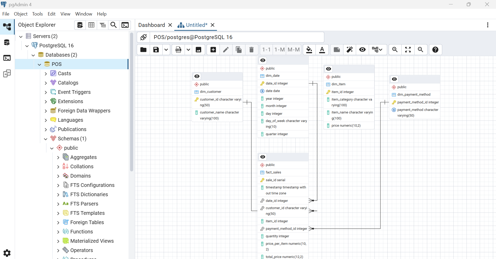
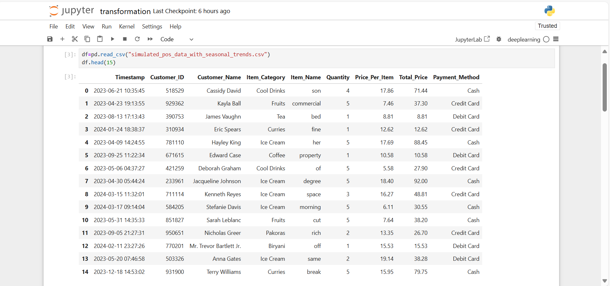
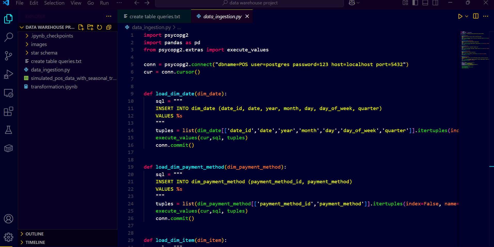
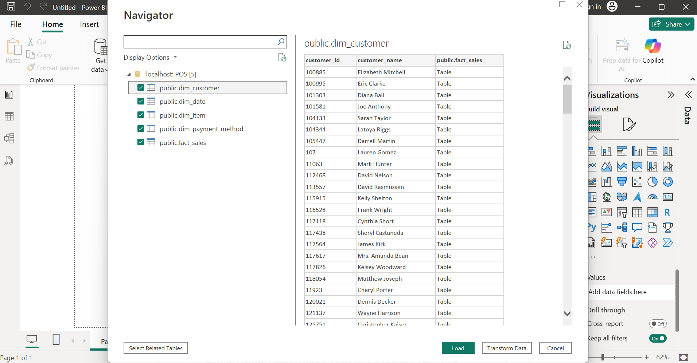
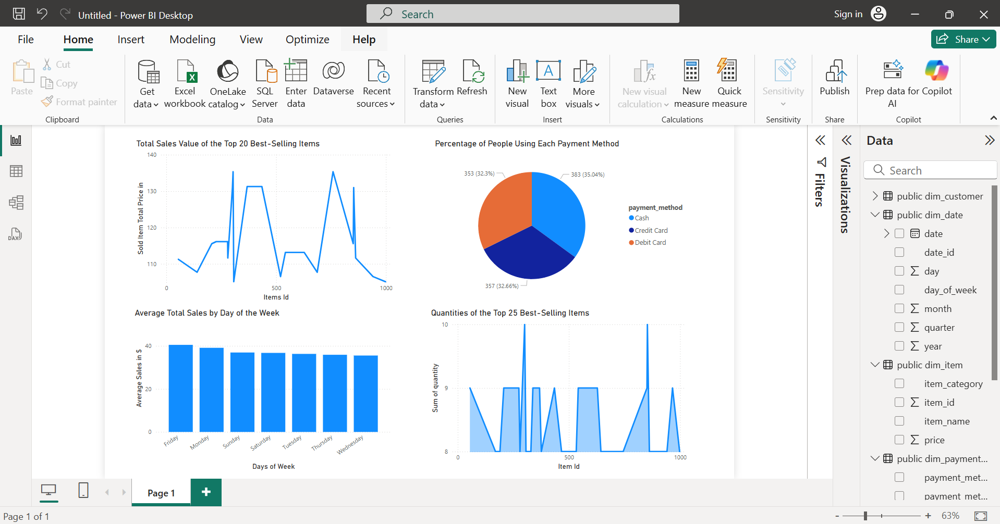

# Point of Sales Data Warehouse to PowerBI Dashboard

A project to practice **ETL pipelines** and **data warehouse modeling** using a local PostgreSQL setup. This project simulates a basic retail Point-of-Sale (POS) analytics workflow, starting from a raw CSV file and ending with a Power BI dashboard connected to a properly modeled star schema.

---

## Objective

To reinforce data warehousing concepts by designing a complete **ETL pipeline**, implementing a **star schema**, and visualizing the results using **Power BI** all without using cloud platforms.

---

## Tools Used

- **Python (Pandas)** – for data cleaning and transformation
- **PostgreSQL** – for storing and modeling the data warehouse
- **pgAdmin** – for schema creation and SQL operations
- **Power BI** – for data visualization and dashboarding

---

## Project Structure

1. `simulated_pos_data_with_seasonal_trends.csv` – initial POS data file with transactions
2. `transformation.ipynb` – notebook to transform and generate dimension/fact tables
3. `star schema` – directory containing transformed CSVs: `dim_customer.csv`, `dim_item.csv`, etc.
4. `create tables` – SQL queries to create the star schema in PostgreSQL
5. `data_ingestion.py` – script to load CSVs into PostgreSQL tables
6. `powerbi_dashboard` – screenshots of the final Power BI dashboard

---

## 🔄 ETL Flow Summary

- **Extract**: Load raw POS transaction data from a CSV file
- **Transform**: Clean and split data into dimension and fact tables (Python Pandas)
- **Load**: Insert transformed data into PostgreSQL using Python + SQL
- **Visualize**: Build a dashboard in Power BI using the PostgreSQL connection

---

## 🧱 Star Schema Design

### Tables:
- `dim_customer`
- `dim_item`
- `dim_payment_method`
- `fact_sales`

---

## 🖼️ Project Workflow Visuals

| Step | Screenshot |
|------|------------|
| Raw CSV Data |  |
| Star Schema Design |  |
| Data in PostgreSQL |  |
| PostgreSQL → Power BI |  |
| Final Dashboard |  |

---

## 📊 Power BI Dashboard Highlights

- Sales by Item Category
- Top Customers by Spending
- Payment Method Distribution
- Daily/Monthly Revenue Trends
